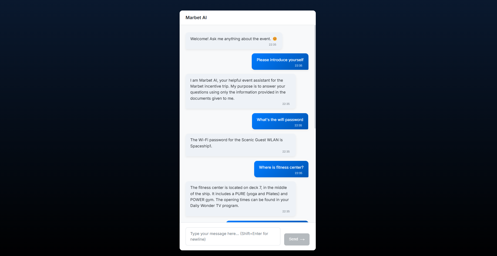
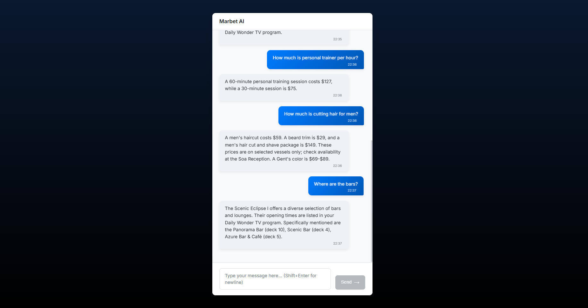

# Marbet AI Event Assistant - RAG Chatbot

## Overview

The Marbet AI Event Assistant is a Retrieval-Augmented Generation (RAG) chatbot designed to assist event attendees by providing accurate information exclusively from event documentation. The system answers questions based on provided PDF documents, ensuring contextually relevant information delivery without hallucination.

The solution can utilize either local Large Language Models via Ollama or cloud-based Google Gemini models, configured through environment variables. LangChain provides the orchestration framework with ChromaDB handling local vector storage.

**Demo:**
<div align="center">
  
  <br>
  
</div>

## Features

* **Retrieval-Augmented Generation:** Answers questions by retrieving relevant context from PDF documents before generating responses
* **Flexible Model Integration:** Supports local Ollama models or Google Gemini models via configuration
* **Advanced Document Processing:** Processes PDF content with strategies for better layout and table extraction
* **Efficient Storage:** Employs ChromaDB for local vector storage with configurable embedding models
* **Intelligent Retrieval:** Uses Maximal Marginal Relevance (MMR) search for diverse and relevant context
* **Conversation Awareness:** Maintains chat history to understand follow-up questions
* **Source Attribution:** Provides transparent source references for all information
* **Multiple Interfaces:** Command-line and web-based UI options

## Technology Stack

* Python 3.9+
* LangChain framework
* Ollama (optional for local models)
* Google Generative AI (optional for cloud models)
* ChromaDB for vector storage
* Tesseract OCR Engine (for PDF processing)
* Flask API backend
* React/Vite frontend

## Setup Instructions

### Prerequisites

* Python 3.9 or higher
* Tesseract OCR Engine (required for processing PDFs)
  * Windows: Download from [Tesseract at UB Mannheim](https://github.com/UB-Mannheim/tesseract/wiki)
  * macOS: `brew install tesseract`
  * Linux: `sudo apt-get install tesseract-ocr`
* Node.js/npm (for frontend only)
* Google API key (for Gemini) or Ollama server access

### Quick Start

1. **Set up environment:**
   ```bash
   python -m venv venv
   source venv/bin/activate  # On Windows: .\venv\Scripts\activate
   pip install -r requirements.txt
   ```

2. **Configure model source:**
   Create a `.env` file in the project root:
   ```
   # For Gemini:
   LLM_SOURCE="gemini"
   GEMINI_API_KEY="YOUR_API_KEY"
   
   # OR for Ollama:
   LLM_SOURCE="ollama"
   OLLAMA_BASE_URL="http://your-ollama-server:11434"
   ```

3. **Add documents:**
   Place event PDF files in the `data/documents/` directory

4. **Run the application:**
   * CLI interface: `python main.py`
   * Web API: `python api.py`
   * Frontend (in separate terminal):
     ```bash
     cd frontend
     npm install
     npm run dev
     ```

## Configuration

Key parameters can be configured through environment variables in the `.env` file:

| Parameter | Description | Default |
|-----------|-------------|---------|
| `LLM_SOURCE` | Model provider (`'gemini'` or `'ollama'`) | `'gemini'` |
| `GEMINI_API_KEY` | Google Gemini API key | Required for Gemini |
| `GEMINI_LLM_MODEL` | Gemini model name | `'gemini-1.5-flash-latest'` |
| `OLLAMA_BASE_URL` | Ollama server URL | `'http://194.171.191.226:3061'` |
| `OLLAMA_LLM_MODEL` | Ollama LLM model name | `'deepseek-r1:32b'` |
| `EMBEDDING_MODEL` | Ollama embedding model | `'mxbai-embed-large:latest'` |
| `CHUNK_SIZE` | Document chunk size | `128` |
| `CHUNK_OVERLAP` | Chunk overlap size | `20` |
| `RETRIEVER_K` | Number of documents to retrieve | `100` |
| `FORCE_REBUILD_VECTOR_STORE` | Force reindexing documents | `False` |

For complete configuration options, see `config.py`.