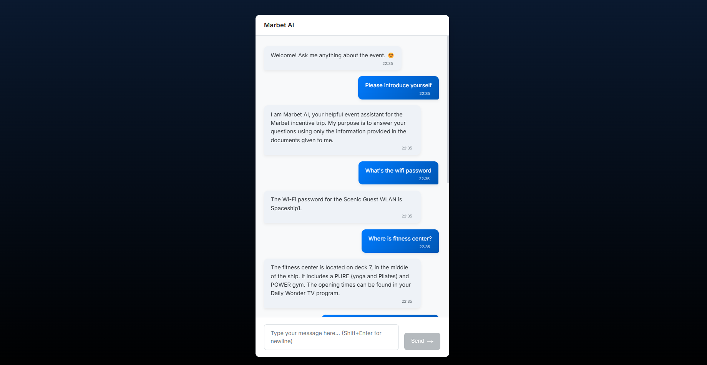
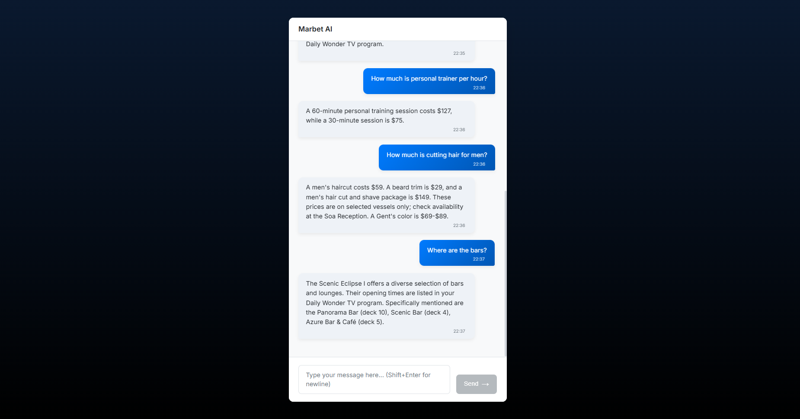
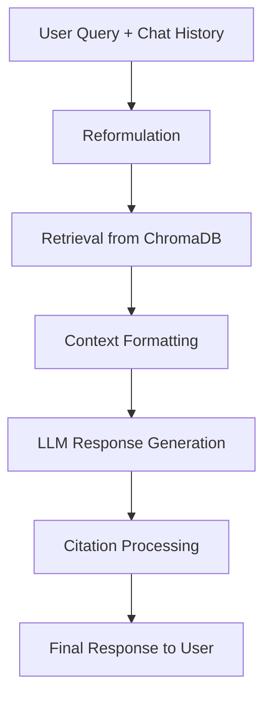

# Marbet AI Event Assistant - RAG Chatbot Analysis Report

  
  
  

  <figure>
    
     
    <figcaption><i>Fig 1: ChatBot UI showing query and response</i></figcaption>
  </figure>
  
   
  
  <figure>
    
     
    <figcaption><i>Fig 2: Response with source attribution</i></figcaption>
  </figure>

## 1. Introduction

**Objective:** Provide Marbet incentive trip attendees accurate information *exclusively* from event PDFs (schedules, packing lists, policies) via a RAG chatbot.

**Technology:** 
- Uses local Ollama (`config.LLM_SOURCE="ollama"`) *or* Google Gemini (`config.LLM_SOURCE="gemini"`, default)
- Configured via `config.py` and environment variables
- Utilizes LangChain for orchestration and ChromaDB for local vector storage
- Enhances guest experience and ensures data privacy (especially with local Ollama)

**Core Functionalities:**

| Feature | Description |
|---------|-------------|
| **PDF Ingestion** | Loads PDFs from `data/documents/` using `UnstructuredPDFLoader` (`strategy="hi_res"`, `mode="elements"`) for better layout and table extraction. |
| **Chunking** | Splits text using `RecursiveCharacterTextSplitter` (configurable size `config.CHUNK_SIZE` (default: 128) / overlap `config.CHUNK_OVERLAP` (default: 20)). |
| **Vectorization** | Creates embeddings using the configured model (Ollama: `config.EMBEDDING_MODEL` or Gemini: `config.GEMINI_EMBEDDING_MODEL`), stored in local ChromaDB. |
| **Retrieval** | Uses ChromaDB (MMR default) to find relevant chunks with configurable parameters. |
| **History Awareness** | Reformulates queries based on chat history using LCEL. |
| **Grounded Answering** | Generates answers using the configured LLM based *only* on retrieved context. |
| **Citation Handling** | Extracts source filenames from citations and filters retrieved documents accordingly. |
| **Interfaces** | CLI (`main.py`) and Flask API (`api.py`) for React frontend. |

## 2. Chatbot Design & Prompt Engineering

### Architecture (LangChain RAG Pipeline)

1. **Input:** User query + chat history
2. **Reformulation:** `contextualize_q_prompt` guides LLM to create a standalone query from history
3. **Retrieval:** Reformulated query fetches chunks from ChromaDB (MMR/similarity)
4. **Formatting:** `format_docs_for_context` prepares retrieved docs with source/page metadata for LLM
5. **Generation:** `qa_prompt` guides LLM (Ollama/Gemini) to answer using *only* formatted context
6. **Output:** Response parsed; API extracts/removes citation text and returns cleaned answer + source metadata

### Key Prompts

<b>Click to expand prompt details</b>

1. **`contextualize_q_prompt`:**
   - Ensures standalone query generation considering history
   - Format: "...formulate a standalone question... Do NOT answer..."
   - Content remains similar to previous version

2. **`qa_prompt`:**
   - Defines persona ("Marbet AI... event assistant...")
   - Core instruction: "answer... strictly using ONLY the information provided in the Context... Do NOT use external knowledge..."
   - Implicitly guides sourcing by providing context labeled with source/page
   - **Note:** Explicit instruction for the `[Source: ..., Page: X]` format has been removed

### Models & Retrieval

<table>
  <tr>
    <th colspan="2">LLM Source Configuration</th>
  </tr>
  <tr>
    <td><b>Ollama</b></td>
    <td>
      • Model: <code>config.OLLAMA_LLM_MODEL</code> (default: <code>deepseek-r1:32b</code>) 
      • URL: <code>config.OLLAMA_BASE_URL</code>
    </td>
  </tr>
  <tr>
    <td><b>Gemini</b></td>
    <td>
      • Model: <code>config.GEMINI_LLM_MODEL</code> (default: <code>gemini-1.5-flash-latest</code>) 
      • Requires <code>GEMINI_API_KEY</code> 
      • Option: <code>config.GEMINI_CONVERT_SYSTEM_MESSAGE</code>
    </td>
  </tr>
  <tr>
    <th colspan="2">Embedding Source (matches <code>LLM_SOURCE</code>)</th>
  </tr>
  <tr>
    <td><b>Ollama</b></td>
    <td><code>config.EMBEDDING_MODEL</code> (default: <code>mxbai-embed-large:latest</code>)</td>
  </tr>
  <tr>
    <td><b>Gemini</b></td>
    <td><code>config.GEMINI_EMBEDDING_MODEL</code> (default: <code>models/embedding-001</code>)</td>
  </tr>
  <tr>
    <th colspan="2">Additional Settings</th>
  </tr>
  <tr>
    <td><b>Temperature</b></td>
    <td><code>config.LLM_TEMPERATURE</code> (default: <code>0.0</code>) for factual responses</td>
  </tr>
  <tr>
    <td><b>Retrieval</b></td>
    <td>
      • MMR default (<code>config.RETRIEVER_SEARCH_TYPE = 'mmr'</code>) 
      • <code>config.RETRIEVER_K</code> (default: 100) - final documents for context 
      • <code>config.RETRIEVER_MMR_FETCH_K</code> (default: 100) - initial fetch for MMR 
      • Similarity search available as alternative
    </td>
  </tr>
</table>

## 3. Knowledge Base Structuring

### Document Processing

- **Loading:** `load_documents` uses `UnstructuredPDFLoader` for PDFs with enhanced parameters
  - Adds `page` (from metadata, fallback to index) and `source` (filename) metadata
  - Uses `strategy="hi_res"`, `mode="elements"` for better extraction

- **Chunking:** `split_documents` uses `RecursiveCharacterTextSplitter`
  - Splits on `\n\n`, `\n`, ` ` (in order of priority)
  - Parameters: `config.CHUNK_SIZE` (default: 128), `config.CHUNK_OVERLAP` (default: 20)
  - Adds `add_start_index=True` for better traceability

### Vector Store

- **Technology:** ChromaDB, persisted locally (`config.VECTOR_DB_PATH`)
- **Embedding:** Uses configured embedding model (Ollama or Gemini)
- **Indexing:** `get_vector_store` builds/rebuilds index when needed
  - Rebuilds if `config.FORCE_REBUILD_VECTOR_STORE` is `True` or store missing
  - Otherwise loads existing store for efficiency

## 4. Conclusion & Future Improvements

### Summary

The RAG chatbot successfully answers questions using *only* local PDF data with several key strengths:
- ✅ Flexible model source (local Ollama privacy or cloud Gemini)
- ✅ Enhanced PDF parsing capabilities
- ✅ Extensive configurability via environment variables
- ✅ History-aware query processing
- ✅ Grounded answers with source attribution
- ✅ Multiple interfaces (CLI/API)

### Recommendations

| Category | Recommendation |
|----------|----------------|
| **Preprocessing** | Fine-tune `UnstructuredPDFLoader` parameters; monitor table/column extraction quality; consider OCR fallback. |
| **Search** | Explore hybrid search (semantic + keyword/BM25) for crucial specific terms. |
| **Filtering** | Add retrieval filtering by document metadata (e.g., only search `schedule.pdf`). |
| **Evaluation** | Implement systematic framework (e.g., RAGAs) to track performance across configuration changes. |
| **UI** | Display source metadata clearly; enable source snippet viewing; add feedback mechanism. |
| **Ops** | Enhance error handling/logging/monitoring, especially for API key and model availability. |
| **Models** | Systematically evaluate different Ollama/Gemini models for optimal trade-offs. |
| **Updates** | Define clear knowledge base update/re-indexing process with efficiency considerations. |
| **Capabilities** | Consider agentic tools if external lookups become necessary (with appropriate constraints). |
